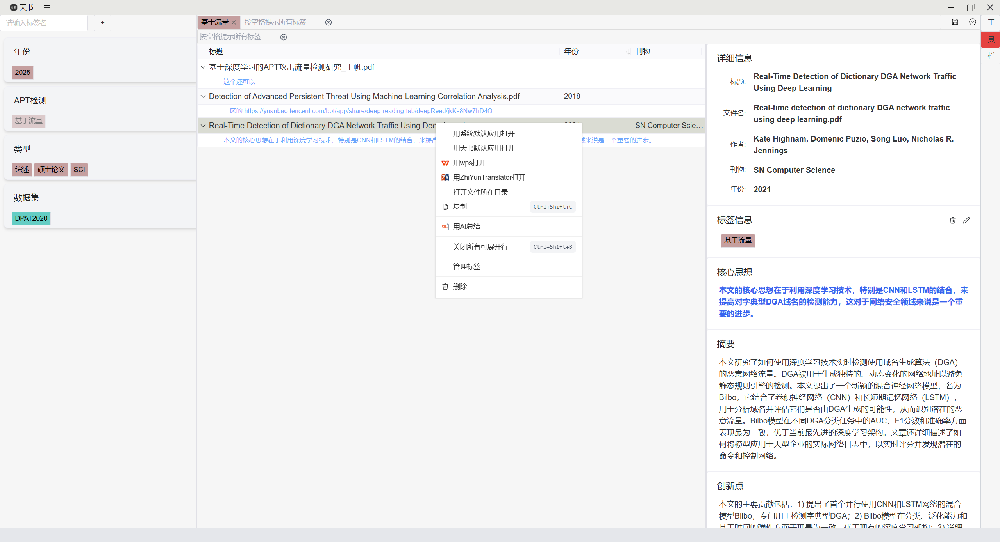
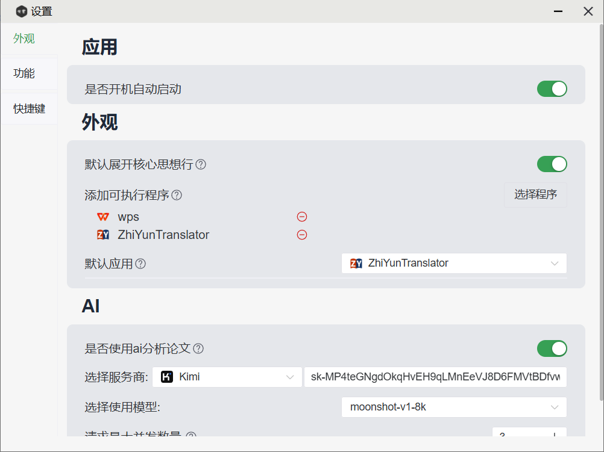
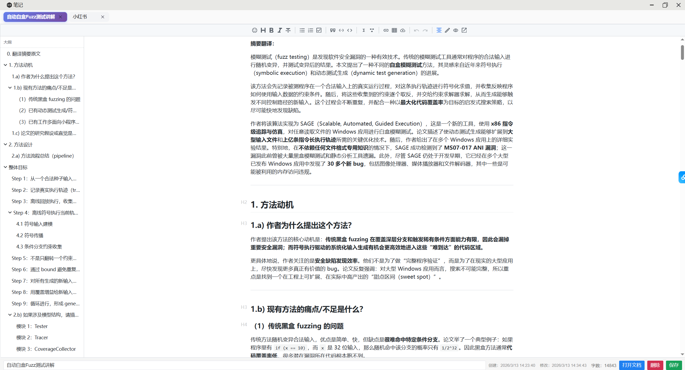

<h1 align="center">天书 LitManagePro</h1>

<p align="center">
  一款面向研究生、博士生与科研工作者的极简文献管理工具
</p>

<p align="center">
  以 <b>标签驱动</b> 的方式组织文献，专注高效检索、阅读、笔记与知识沉淀
</p>

<p align="center">
  
  
  
  
</p>

<p align="center">
  
  
  
  
</p>

---

## 📖 项目简介

**天书 LitManagePro** 是一款专为科研场景设计的轻量级文献管理软件，适用于研究生、博士生及科研工作者。

与传统依赖文件夹层级的管理方式不同，天书采用 **纯标签驱动** 的组织模式，让文献分类、交叉归档与组合筛选更加灵活。你可以围绕研究主题、方法、任务阶段或个人习惯构建自己的文献体系，而不必受限于固定目录结构。

它不仅关注“收纳文献”，更关注科研工作流中的核心需求：**快速定位、信息提取、阅读记录、摘要理解与知识沉淀**。

## 为什么是天书？

现有不少文献管理工具功能完整，但对于部分科研用户来说，仍然存在上手成本高、分类方式僵化、阅读与笔记体验割裂等问题。

天书希望提供一种更轻、更灵活的文献管理方式：以标签替代层级目录，以筛选替代来回翻找，让科研资料管理更符合真实研究工作流。

## ✨ 核心特色

### 🏷 纯标签管理

摒弃传统文件夹分类方式，使用灵活的标签系统组织文献。
同一篇文献可同时属于多个主题、项目或研究方向，适合真实科研场景中的多维归类需求。

### 🔍 双重标签筛选

标签栏分为上下两层：

- **上栏标签：必须同时包含**
- **下栏标签：任选其一包含**

通过“必须满足 + 任一匹配”的组合逻辑，更高效地缩小检索范围，快速定位目标文献。

### ⚡ 快捷标签组

支持将常用的标签组合保存为快捷筛选方案。
面对高频检索场景时，无需重复勾选，真正做到一键直达。

### 🤖 AI 摘要生成

集成 AI 能力，自动提炼论文核心内容，帮助用户在短时间内把握文献主旨，提升初筛与阅读效率。

### 🧠 核心信息提取

自动提取作者、期刊/会议、发表时间等关键信息，减少手动录入成本，提升文献导入体验。

### 📝 笔记与导出

支持在阅读过程中记录笔记、整理想法与提炼结论，帮助形成个人知识资产。
笔记内容支持导出为 **PDF** 与 **Markdown**，便于分享、归档与二次加工。

---


## 下载

你可以在 [Releases](https://github.com/Xiaobaishushu25/LitManagePro/releases) 页面下载适用于 Windows / macOS / Linux 的安装包。


## 🖼 软件截图

### 主界面



### 设置页



### 笔记页



---

## 🚀 适用场景

- 管理论文、技术报告、课程文献等科研资料
- 为文献建立多维标签体系（方向 / 方法 / 任务 / 优先级）
- 快速筛选某一研究主题下的相关工作
- 在阅读过程中沉淀摘要、批注与笔记
- 借助 AI 快速完成文献初步理解

---

## 🧩 技术栈

- **前端**：Vue.js
- **后端**：Rust
- **桌面框架**：Tauri

---

## 📦 快速开始

### 1. 克隆项目

```bash
git clone https://github.com/Xiaobaishushu25/LitManagePro.git
cd LitManagePro
```

### 3. 运行项目

```bash
pnpm tauri dev
```

---

## 🛠 使用方法

1. **导入文献**
   支持导入 PDF、TXT 等多种格式文献。
2. **添加标签**
   为文献添加主题、方法、阶段、项目等标签，构建个性化知识体系。
3. **筛选检索**
   使用标签组合或快捷标签组快速定位目标文献。
4. **查看摘要**
   借助 AI 自动生成摘要，快速了解文献核心内容。
5. **记录笔记**
   在阅读过程中沉淀自己的思考，并导出为 PDF 或 Markdown。

---

## 🗺 Roadmap

未来计划持续完善以下能力：

* [ ]  更完善的文献信息识别与元数据补全
* [ ]  更丰富的文献阅读标注能力
* [ ]  标签管理体验优化
* [ ]  更强的 AI 辅助阅读与总结功能
* [ ]  BibTeX / RIS 等学术格式支持

欢迎通过 Issue 提出建议，一起完善天书。

---

## 🤝 贡献指南

欢迎开发者参与项目建设，无论是提交代码、修复问题、完善文档，还是提出功能建议都非常欢迎。

你可以通过以下方式参与：

* 提交 Issue 反馈问题或建议
* 提交 Pull Request 改进代码
* 完善文档与使用说明

---

## 💬 反馈与交流

如果你在使用过程中遇到问题，或对产品有任何建议，欢迎通过 GitHub Issue 与我们交流。

如果这个项目对你有帮助，也欢迎点一个 ⭐ Star 支持一下。

---

## 📄 开源许可

本项目基于 [MIT License](https://panda2.agii.cc/c/LICENSE) 开源。